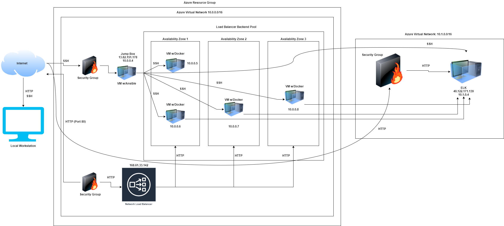
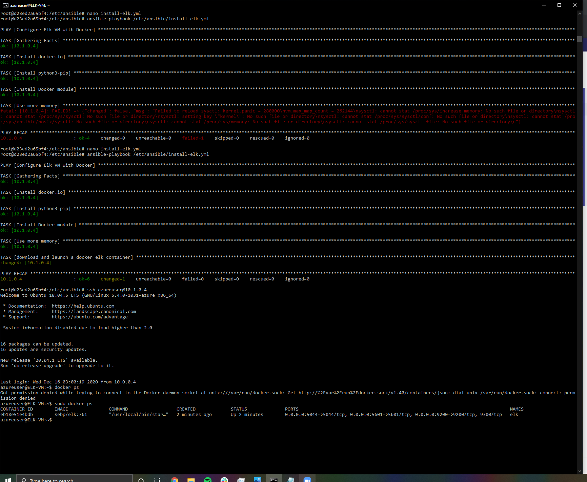

## Automated Elastic Stack Deployment

The files in this repository were used to configure the network shown below.

These files have been tested and used to generate a live ELK deployment on Azure. They can be used to either recreate the entire deployment pictured above. Alternatively, select portions of the install-elk.yml file may be used to install only certain pieces of it, such as Filebeat.

This document contains the following details:
- Description of the Topology
- Access Policies
- ELK Configuration
  - Beats in Use
  - Machines Being Monitored
- How to Use the Ansible Build

### Description of the Topology

The main purpose of this network is to expose a load-balanced and monitored instance of DVWA, the D*mn Vulnerable Web Application.

Load balancing ensures that the application will be highly available, in addition to restricting access to the network. The load balancer
implemented in this network ensures that none of the servers will be overwhelmed by the amount of traffic they receive, even in the event of a DDoS attack. The jump box provides tremendous value by creating a single audit point that we can use to verify that all traffic reaching the virtual servers is from trusted sources which prevents malicious software from infecting our system.  

Integrating the ELK server allows users on this network to easily monitor the vulnerable VMs for changes to the logs and system traffic. Filebeat
allows me to easily centralize log data from all the locations that I am interested in monitoring. It makes it simple to stay on top of any changes that might be problematic for my network.
- _TODO: What does Metricbeat record?_(Optional)

The configuration details of each machine may be found below.

| Name     | Function | IP Address | Operating System |
|----------|----------|------------|------------------|
| Jump Box | Gateway  | 10.0.0.4   | Linux            |
| Web-1    | Server   | 10.0.0.5   | Linux            |
| Web-2    | Server   | 10.0.0.6   | Linux            |
| Web-3    | Server   | 10.0.0.7   | Linux            |
| ELK-VM   | Analyzer | 10.1.0.4   | Linux            |

### Access Policies

The machines on the internal network are not exposed to the public Internet. 

Only the Jump Box machine can accept connections from the Internet. Access to this machine is only allowed from the following IP address:
- 69.217.138.43

Machines within the network can only be accessed by the Jump Box Provisioner which uses IP 10.0.0.4.

A summary of the access policies in place can be found in the table below.

| Name     | Publicly Accessible | Allowed IP Addresses |
|----------|---------------------|----------------------|
| Jump Box | Yes                 | 69.217.138.43        |
| Web-1    | No                  | 10.0.0.4             |
| Web-2    | No                  | 10.0.0.4             |
| Web-3    | No                  | 10.0.0.4             |
| ELK-VM   | No                  | 10.0.0.4             |

### Elk Configuration

Ansible was used to automate configuration of the ELK machine. No configuration was performed manually, which is advantageous because you can issue commands to multiple servers from a single playbook. This is helpful with a few servers like this network but becomes immensely more valuable as the network becomes larger. This same technique can be used on thousands of servers at once.

The playbook implements the following tasks:
- Use the apt module to install docker.io
- Use the apt module to install python3-pip
- Use the pip module to install docker python module
- Use the sysctl module to enhance memory using vm.max_map_count with a value of 262144
- Use the docker container module to download and launch a docker elk container 

The following screenshot displays the result of running `docker ps` after successfully configuring the ELK instance.

### Target Machines & Beats
This ELK server is configured to monitor the following machines:
- Web-1: 10.0.0.5
- Web-2: 10.0.0.6
- Web-3: 10.0.0.7

I have installed the following Beats on these machines:
- Filebeat
- Metricbeat

These Beats allow us to collect the following information from each machine:
- TODO 
### Using the Playbook
In order to use the playbook, you will need to have an Ansible control node already configured. Assuming you have such a control node provisioned: 

SSH into the control node and follow the steps below:
- Copy the filebeat-config.yml file to /etc/ansible/.
- Update the /etc/ansible/hosts file to include the webserver and elkserver ip addresses.
- Run the playbook, and navigate to http://40.122.51.162:5601/app/kibana to check that the installation worked as expected.

_As a **Bonus**, provide the specific commands the user will need to run to download the playbook, update the files, etc._